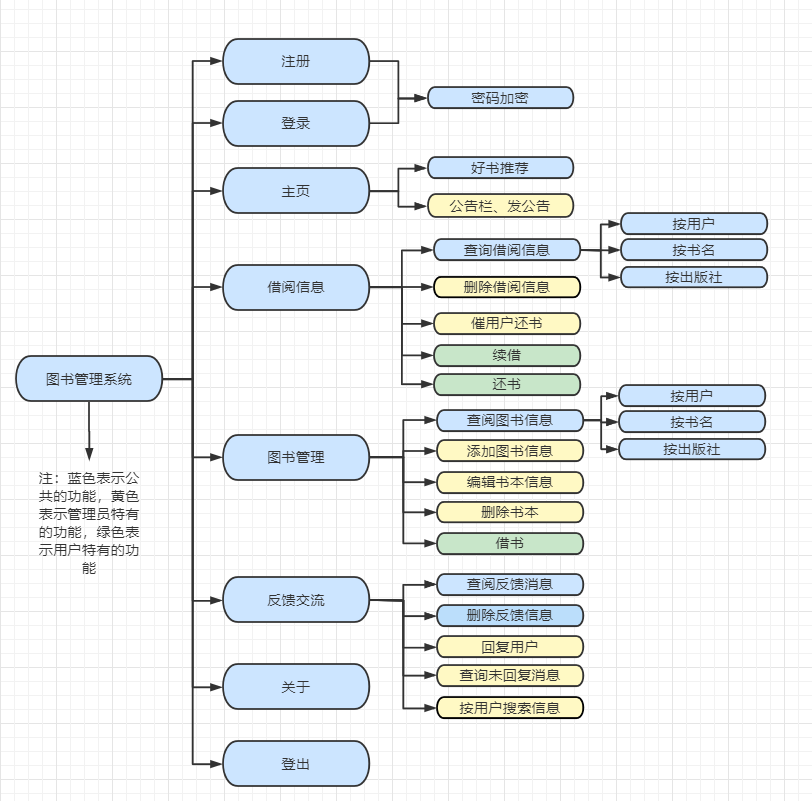
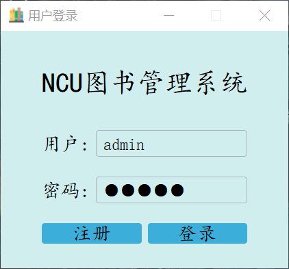
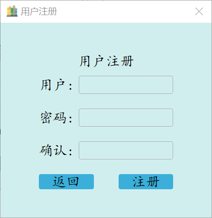
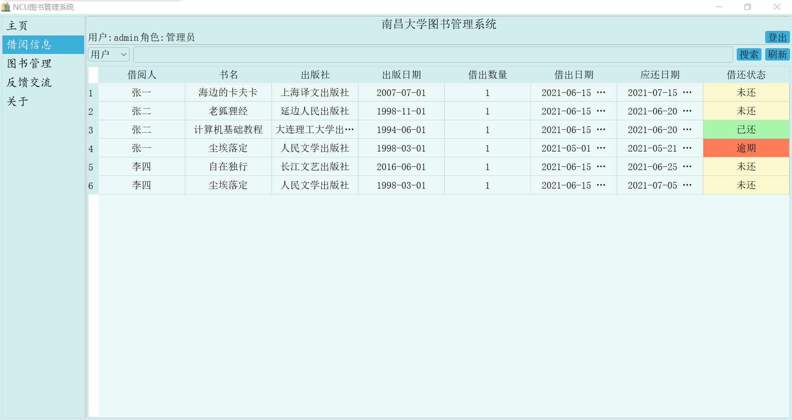
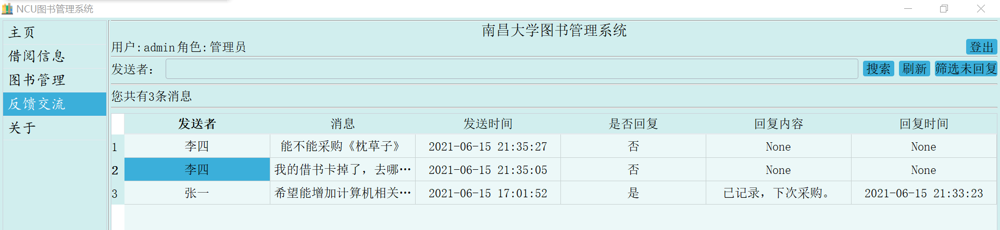
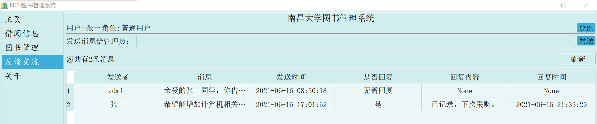
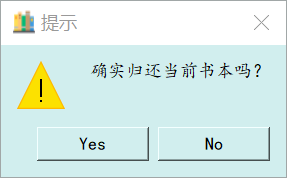

# BookManager

## 下载
```
npm install
```

## 运行

- 确保本机启动了MYSQL服务
- 修改`generate_data.py`的用户名和密码并运行该文件
- 运行`main.py`


## 功能

对于不同角色的功能需求分析如下：

**普通用户：**

- 注册、登录系统
- 查看系统推荐书籍、查看系统公告
- 借书、还书、续借、查找书籍
- 发送消息给管理员
- 系统帮助与关于

**管理员：**

- 注册、登录系统
- 设置系统推荐书目、发布公告
- 添加书籍、编辑已有书籍、删除书籍、查找书籍、催用户还书
- 筛选未回复消息、回复普通用户的消息、删除消息
- 系统帮助与关于



## 页面展示



















